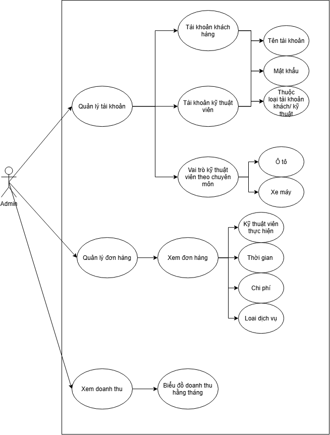

### **TÀI LIỆU THIẾT KẾ HỆ THỐNG**

**Tên Đề Tài:** Xây dựng nền tảng kết nối dịch vụ chăm sóc, sửa chữa xe tại nhà"

**Sinh viên 1:** Nguyễn Phạm Quỳnh Long - MSSV: 2174802010089

**Sinh viên 2:** Ngô Minh Hưởng - MSSV: 2274802010355

**Giảng viên hướng dẫn:** Nguyễn Trí Hải

**Phiên bản:** 1.0

**Ngày:** Tháng 10, 2026

**Người viết:** Đội phát triển

**Trạng thái:** Dự thảo

---

## 1.Mô tả đề tài

### 1.1 giới thiệu đề tài 

Nền tảng ** Sửa chữa, chăm sóc xe tại nhà ** là nền tảng kết nối dịch vụ chăm sóc, sửa chữa xe tại nhà, nhằm cung cấp hướng dẫn rõ ràng cho quá trình phát triển, kiểm thử và triển khai.

### 1.2 Phạm vi đề tài

* **Nền tảng bao gồm ứng dụng chính**
    * **Ứng dụng khách hàng (customer):** Ứng dụng cho chủ xe ôtô/xe máy
    * **Ứng dụng kỹ thuật viên (Technician)** Ứng dụng cho kỹ thuật viên nhận việc
    * **Trang web admin (doanh nghiệp)** Trang dành cho doanh nghiệp quản lý hoạt dộng

### 1.3 Các bên liên quan

* **Chủ xe (customer)** Người dùng sở hữu xe máy/ ôtô đặt lịch
* **Kỹ thuật viên (technician)** Là người chuyên sửa xe, bảo dưỡng xe.
* **Gara (doanh nghiệp):** Cơ sở kinh doánh sửa xe.
* **Quản trị viên (Admin):** người quản lý hệ thống cho doanh nghiệp.

---

## 2.Tổng quan về hệ thống
### 2.1 Mô tả chung
nền tảng kết nối trực tiếp với kỹ thuật viên/gara để cung cấp các dịch vụ chăm sóc, bảo dưỡng, sửa chữa tại nhà.Hệ thống sử dụng công nghệ định vị để tìm kỹ thuật viên gần nhất, thuật toán ghép cặp thông minh, theo dõi thời gian thực và thanh toán trực tuyến.

### 2.2 Các tính năng chính
**1. Đặt lịch dịch vụ:** chủ xe chọn loại dịch vụ, địa điểm, thới gian.
**2. Ghép cặp tự động (Macthing):** Hệ thống tìm kỹ thuật viên phù hợp dựa vào vị trí và tọa độ.
**3.Theo thời gian thực:** GPS tracking, cập nhậ trạng thái dịch vụ theo thời gian thực. 
**4. Đánh giá hai chiều:** Cả khách hàng và kỹ thuật viên có thể đánh giá nhau
**5. Thanh toán trực tuyến:** Hỗ trợ VNPay, Momo
**6. Quản lý doanh nghiệp:** Thống kê doanh thu, quản lý nhân sự, đơn hàng

---

## 3. Yêu cầu các chức năng (Functional Requirements)
Dưới đâu là các yêu cầu chi tiết của hệ thống, được mô tả dưới dạng User Stories

### 3.1 Khách hàng
* **ID:FR-001: Khách hàng đăng ký tài khoản**
    * **Mô tả:** Là một Người dùng, tôi muốn đăng ký tài khoản để sử dụng các dịch vụ
* **Yêu cầu**
    * Đăng ký tài khoản qua nhập tên tài khoản, số điện thoại hoặc email
    * Chọn hoặc tự động thuộc loại tài khoản (khách hàng/kỹ thuật viên)

* **ID:FR-002: Kỹ thuật viên đăng ký tài khoản**
    * **Mô tả:** Là một người dùng đã qua đào tạo sửa chữa xe, tôi muốn đăng ký tài khoản để tôi có thể trở thành nhân viên của doanh nghiệp.
* **Yêu cầu**
    * Có CV ứng tuyển doanh nghiệp
    * Phỏng vấn
    * Doanh nghiệp sẽ báo với Admin tạo tài khoản

* **ID:FR-003: Đăng nhập**
    * **Mô tả:** Là một Người dùng, tôi muốn đăng nhập để tôi sử dụng các dịch vụ
* **Yêu cầu**
    * Có tài khoản trên hê thống gồm Tên tài khoản, mật khẩu
    * Ghi nhớ đăng nhập tùy chọn
    * Khôi phục mật khẩu qua email/SĐT

* **ID:FR-004: Xem và chỉnh sửa hồ sơ cá nhân**
    * **Mô tả:** Là một người dùng, tôi muốn xem thông tin của mình để có thể chỉnh sửa thông tin cá nhân
* **Yêu cầu**
    * Có tài khoản trên hê thống
    * Xem thông tin hồ sơ (tên, SĐT, Email, địa chỉ, loại xe, biển số xe)
    * Lịch sử hoạt động

### 3.2 Kỹ thuật viên
* **ID:FR-005: Tạo đơn hàng**
    * **Mô tả:** Là một người dùng tôi muốn đặt một đơn dịch vụ để có thể sửa chữa, chăm sóc xe của mình.
* **Yêu cầu**
    * Chọn loại dịch vụ (Thay nhớt, Thay vỏ bánh xe, Thay pin xe ôtô, Kiểm tra,...)
    * Chọn loại xe
    * Nhập thông tin xe
    * Chọn địa điểm
    * Mô tả sự cố (nếu chọn kiểm tra)
    * Thêm ảnh hư hỏng (tùy chọn)
    * Niên yết giá dự kiến

* **ID:FR-006: Xem và quản lý đơn hàng**
    * **Mô tả:** Là một người dùng tôi muốn xem đơn hàng để tôi dễ dàng quản lý
* **Yêu cầu**
    * Danh sách các đơn đã đặt (đang thực hiện, hoành thành, hủy)
    * chi tiết đơn hàng
    * Huye đơn nếu chưa có kỹ thuật viên
    * Lịch sử đơn hàng

* **ID:FR-008: Nhận/từ chối đơn** 
    * **Mô tả:** Là một kỹ thuật viên, tôi sẽ nhận được thông báo có đơn mới để nhận hoặc từ chối đơn.
* **Yêu cầu**
    * Thông báo ngay khi có đơn mới
    * Xem chi tiết đơn
    * Nút nhận đơn 
    * Sau 30 giây mà không nhận sẽ tự dộng từ chối
    * Nếu từ chối thì sẽ tìm kỹ thuật viên khác
### 3.3 Thuật toán ghép cặp (Matching)
* **ID:FR-007: Thuật toán ghép cặp (Matching)** 
    * **Mô tả:** Là một người dùng, tôi muốn tìm một kỹ thuật viên để sửa xe có tay nghề phù hợp
* **Yêu cầu**
    * Tìm kỹ thuật viên trong bán kím 15km từ vị trí khách hàng
    Ưu tiên kỹ thuật viên
    * Có chuyên môn phù hợp
    * Gần nhất
    * Đánh giá cao
    * Đang rảnh

### 3.4 Theo dõi thời gian thực (Real-time Tracking)
* **ID:FR-009: Theo dõi vị trí kỹ thuật viên**
    * **Mô tả:** Là một người dùng, tôi muốn xem vị trí của kỹ thuật viên trên bản đồ
* **Yêu cầu**
    * Bản dồ Leaflet + OpenStreetMap
    * hiển thị vị trí theo thời gian thực (cập nhật 10 giây/lần)
    * Lộ trình chi tiết
    * Thông tin kỹ thuật viên (ảnh, tên, SĐT)

* **ID:FR-010: Cập nhật trạng thái dịch vụ**
    * **Mô tả:** Là một kỹ thuật viên, tôi cần phải cập nhật trạng thái dịch vụ
* **Yêu cầu**
    * Trạng thái dịch vụ:
        Đang đến
        Đã đến
        Đang kiểm tra
        Đang sửa chữa
        Hoàn thành
    * Kỹ thuật viên ghi chú nếu có phát hiện thêm

### 3.5 Thanh toán
* **ID:FR-011: Thanh toán trực tuyến**
    * **Mô tả:** Là một người dùng, tôi muốn thanh toán dịch vụ khi hoàn thành bảo dưỡng
* **Yêu cầu**
    * Hiển thị giá dịch vụ
    * Hỗ trợ VNPay/Momo
    * Tùy chọn thanh toán trước, sau
    * Xử lý giao dịch
    * Hóa đơn/biên nhận tự động
    * Nếu là tiền mặt thì nhận tiền rồi ấn nút hoành thành

* **ID:FR-012: Lịch Sử Giao Dịch**
    * **Mô tả:** Là một người dùng, tôi muốn xem lịch sử thanh toán để có thể xem và đặt lại dịch vụ khi cần thiết.
* **Yêu cầu**
    * Danh sách giao dịch
    * Lọc theo ngày
    * Chi tiết giao dịch

### 3.6 Đánh giá và uy tín
* **ID:FR-013: Đánh giá hai chiều**
    * **Mô tả:** Là một người dùng, tôi muốn đánh giá kỹ thuật viên và kỹ thuật viên sẽ đánh giá về tôi.
* **Yêu cầu**
    * Xếp hạng 1- 5 sao
    * Bình luận (tùy chọn)
    * **Đánh giá kỹ thuật viên:**Chuyên môn. thái dộ, thời gian chất lượng
    * **Đánh giá khách hàng:**Thái độ, thanh toán, thông tin, địa chỉ chính xác
    * Hiển thị cả 2 đánh giá sau khi hoàn thành đơn

* **ID:FR-014: Hệ thống uy tín**
    * **Mô tả:** Là một kỹ thuật viên, tôi muốn xem uy tín của tôi do hệ thông tính toán để tính toán dựa trên đánh giá
* **Yêu cầu**
    * Điểm uy tính = (tổng sao)/(Số lần đánh giá)
    * Uy tín kỹ thuật viên ảnh hưởng đến việc ghép cặp
### 3.7 Quản trị Admin
* **ID:FR-015: Quản lý tài khoản**
    * **Mô tả:** Là một quản trị viên, tôi muốn xem, thêm, xóa, sửa, tài khoản của khách hàng, đặt biệt là các kỹ thuật viên. 
* **Yêu cầu**
    * Tên tài khoản/Số điện thoại
    * Mật khẩu
    * Thuộc loại tài khoản 

* **ID:FR-016: Quản lý đơn hàng**
    * **Mô tả:** Là một quản trị viên, tôi muốn xem chi tiết các đơn hàng do kỹ thuật viên đã hoàn thành. 
* **Yêu cầu**
    * Xem như hóa đơn
    * Có tên người thực hiện
    * Thời gian

* ** **ID:FR-017: Quản lý doanh thu**
    * **Mô tả:** Là một quản trị viên, tôi muốn xem doanh thu hằng tháng. 
* **Yêu cầu**
    * Biểu đồ thống kê

---

## 4 Yêu cầu phi chức năng (Non-functional Requirements)
Một số yêu cầu quan trọng khác về chất lương:
* **Hiệu năng**
    * Hệ thống phản phản hồi trong vòng 2 giây đối với các thao tác người dùng đăng nhập, tạo đơn, tải trang trong điều kiện bình thường
* **Khả dụng (Usability):**
    * GIao diện trực quan và dễ sử dụng
    * các thông báo lỗi hoặc thành công phải rõ ràng
* **Bảo mật**
    * Mật khẩu của người dùng phải được mã hóa trước khi lưu trữ trong cơ sở dữ liệu.

---
## 6. Sơ đồ Use Case (Use Case Diagram)
* Khách hàng và kỹ thuật viên
.png>)
* Admin
